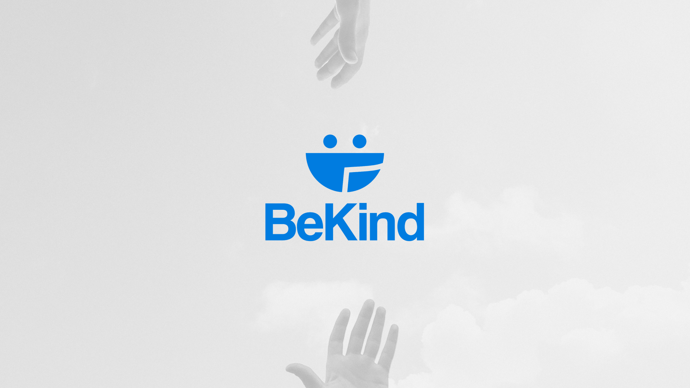

# 🫂 BeKind - Plataforma de Ajuda Social

Bem-vindo ao repositório da BeKind! A BeKind é uma plataforma em desenvolvimento que tem como objetivo ajudar moradores de rua e pessoas em situação de vulnerabilidade. Nossa missão é fornecer suporte, recursos e conscientização sobre questões sociais. Este projeto foi criado como parte do meu projeto de conclusão de curso e visa promover a solidariedade, empatia e compaixão em relação às pessoas em situação de vulnerabilidade.

## 💙 Objetivo

A BeKind tem como objetivo conectar voluntários, vulneráveis e organizações que desejam fazer a diferença na vida dessas pessoas. Fornecemos uma maneira fácil e eficiente de contribuir para a causa social. Nossa plataforma oferece diversas funcionalidades para atingir esse propósito.

## 💻 Funcionalidades Principais

- **Home**: A página inicial é onde os usuários podem encontrar uma visão geral da BeKind e aprender mais sobre a missão e os objetivos da plataforma.

- **Sobre nós**: Nesta seção, você pode encontrar informações detalhadas sobre a história da BeKind, sua equipe e o propósito da plataforma.

- **Blog**: A página do blog é onde os usuários podem ler informações atualizadas sobre a situação das pessoas em situação de rua, incluindo notícias, histórias de impacto e informações relevantes.

- **Doações**: A página de doações mostra aos usuários as doações em extrema necessidade das ONGs, permitindo que eles contribuam de forma direcionada para ajudar aqueles que mais precisam.

- **Cadastro de Voluntário**: Nesta seção, pessoas interessadas em contribuir como voluntários podem se inscrever.

- **Loja**: A seção da loja permite que você compre produtos relacionados à nossa causa, onde os fundos arrecadados contribuem diretamente para nossos esforços em prol da assistência social.

## 📞 Contato

Se você tiver alguma dúvida, sugestão ou feedback, sinta-se à vontade para entrar em contato conosco:

- E-mail: bekindtcc@gmail.com
- Instagram: @bekind.initiative